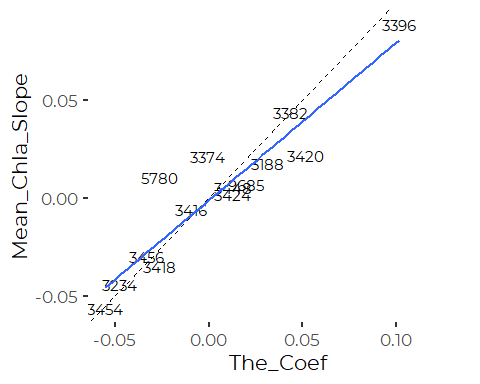
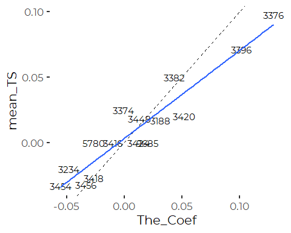

Confirm Methods for PWD Trend Analysis
================
Curtis C. Bohlen, Casco Bay Estuary Partnership
12/19/2020

  - [Introduction](#introduction)
      - [Derived Statistics in the Source Excel
        File](#derived-statistics-in-the-source-excel-file)
      - [Kendall’s Tau](#kendalls-tau)
  - [Strategy](#strategy)
  - [Load Libraries](#load-libraries)
  - [Folder References](#folder-references)
  - [Load PWD Water Quality Trend
    Data](#load-pwd-water-quality-trend-data)
  - [Load Maine Lakes Annual Data](#load-maine-lakes-annual-data)
  - [Looking at Kendall’s Tau](#looking-at-kendalls-tau)
  - [Looking at Slopes](#looking-at-slopes)
      - [Linear Models](#linear-models)
          - [Are Our Slopes Similar to PWD
            Data?](#are-our-slopes-similar-to-pwd-data)
      - [Theil-Sen Slope Estimators](#theil-sen-slope-estimators)
          - [Are Our Slopes Similar to PWD
            Data?](#are-our-slopes-similar-to-pwd-data-1)
  - [Commentary](#commentary)
      - [Why don’t results match
        exactly?](#why-dont-results-match-exactly)


# Introduction

In this notebook, we do some forensic analysis to try to confirm the
meaning of some derived data found in the data Portland Water District
(PWD) shared with us. Specifically, the data file contains raw data on
land use, but includes only derived numerical values for water quality
data. While recent mean Secchi depth is clear, the process for coming up
with the water quality trend scores relies on a derived value.

Paul Hunt of PWD presented at the Maine Water Conference some years ago
on the method, and kindly shared the presentation PowerPoint,. in
addition, PWD published an article on the method (or a closely related
method) in LakeLines:

> Hunt, Paul T., Kate McDonald, and Kirsten Ness. 2016. Sebago Lake,
> Maine and the Water QUality Index: A Method for Subwatershed
> Protection. LakeLine, 36(3)10-18. North American Lake Management
> Society. Fall 2016. Available here:
> <https://www.pwd.org/sites/default/files/hunt.pdf>

Descriptions of statistical methods from the paper are (as is common) a
bit unclear, so here we take a very quick look at related ideas, to see
if we can roughly recreate PWD results. In a very quick analysis, we
don’t fully succeed.

As we are only using the PWD index as a “Sidebar”, we do not take the
time to resolve all inconsistencies. This analysi, however, gives un
confidence that we understand PWD’s analyses, even if we can not
recreate them entirely in the time available.

## Derived Statistics in the Source Excel File

In the Excel spreadsheet, derived values related to long-term water
quality trends are found in at least three Worksheets:

  - “WQ 4 Coefficient absolute value”  
  - “WQ 5 Trend chart”  
  - “WQ Trend Chart for PP”

In these worksheets, numerical values (similar up to sign, or rescaling
by a factor of 100) are labeled in two different ways, and sometimes
remain unlabeled. Labeled versions include:

  - "Water Quality trend slope for comparison\*"  
  - "Coefficient corrected for STD data\*"

Unlabeled versions are found in the \* “WQ 4 Coefficient absolute value”
worksheet, and include what appear to be (by comparison with values in
other worksheets) coefficient estimators and P values.

It appears the process was as follows 1. Calculate the “Coefficient” or
“Slope” and “p-value” (method unknown). Raw results shown only on the
“WQ 4 Coefficient absolute value” worksheet, in unlabeled columns. We
infer their meaning by comparison with similar labeled columns. 2.
Multiply coefficients derived from Secchi depth data by negative one, so
that a positive value always corresponds to worsening water quality.
Results on “WQ 4 Coefficient absolute value” as the named column “Water
Quality trend slope for comparison*". 3. Multiply by 100 to produce
"Coefficient corrected for STD data*”

The fact that PWD multiplied the resulting value by 100 suggests that
they thought of the value as in some sense equivalent to a percentage.

Values of correlation coefficients and their non-parametric cousin,
Kendall’s Tau, range from -1 to + 1. Multiplying by 100 generates a
value between -100 and + 100, which is percentage-like.

## Kendall’s Tau

The LakeLines paper mentions tend analysis based on the “Mann-Kendall”
test. Mann-Kendall test has several other names, and is closely related
to the Thiel- Sen estimator of slope. Crucially, it produces a test
statistic, known as Kendall’s Tau, which ranges from -1 to +1, and is a
nonparameteric equivalent to the standard (Pearson) correlation
coefficient. Kendall’s Tau is widely used in environmental data analysis
because it is insensitive to monotonic transformations, and is thus
considered “nonparametric”.

Several packages in R implement a Mann-Kendall test, but base r offers
an implementation as an option within the `cor()` or `cor.test()`
functions, with ‘method = ’kendall’. (Technically, it appears the test
under `cor.test()` uses a slightly different estimate of the P values
from the original Mann-Kendall test, but the tests are are similar in
concept, and the test statistics – known as Kendall’s Tau – are the
same.)

# Strategy

PWD papers refer to a number of analytic filters they used to decide
what data to include in their analyses. We do not have access to their
raw data, and thus can not duplicate all of their analytic choices. IN
partiocular, they imposed various data completeness standards that we
can not readily reconstruct.

Because we do not know exactly how data was prepared for the PWD
analyses, we rely on annual water quality means data prepared by Maine
DEP as a rough comparison set to results from the PWD Excel
spreadsheets. We then calculate Kendall’s Tau on those data for the
lakes

# Load Libraries

``` r
library(tidyverse)
#> -- Attaching packages --------------------------------------- tidyverse 1.3.0 --
#> v ggplot2 3.3.2     v purrr   0.3.4
#> v tibble  3.0.4     v dplyr   1.0.2
#> v tidyr   1.1.2     v stringr 1.4.0
#> v readr   1.4.0     v forcats 0.5.0
#> -- Conflicts ------------------------------------------ tidyverse_conflicts() --
#> x dplyr::filter() masks stats::filter()
#> x dplyr::lag()    masks stats::lag()
library(readxl)
#library(readr)

library(mblm)

library(CBEPgraphics)
load_cbep_fonts()
theme_set(theme_cbep())
```

# Folder References

``` r
sibfldnm <- 'Original_Data'
parent <- dirname(getwd())
sibling <- file.path(parent,sibfldnm)

dir.create(file.path(getwd(), 'figures'), showWarnings = FALSE)
```

# Load PWD Water Quality Trend Data

The final `regex`gsub\` is to remove square bracketsand asterisks from
the coefficient values derived from Secchi depth data, so we can convert
them to numeric values. But notice that the brackets (in the excel file)
limit precision to only two significant digits. That appears to have
been the case throughout the Excel file – the negated values are lower
precision estimates.

``` r
fn <- 'Sebago Lake Subwatersheds Summary of Analyses through 2017.xlsx'
sel_sheet <- "WQ 4 Coefficient absolute value"
fpath <- file.path(sibling, fn)

pwd_data <- read_excel(fpath, sheet = sel_sheet, range = 'A1:n22') %>%
  select(-`Lake Name...3`, -`Lake Name...13`, - MIDAS,  -`Green Trend...14`) %>%
  rename(Lake = `Lake Name...1`,
         MIDAS = `MIDAS #`,
         WQ_Trend = `WQ Trend Slope for comparison*`,
         Source_Param = ...6,
         Years = `Years of record`,
         Last_Year = ...8,
         The_Coef = ...9,
         p_value = ...10,
         trend_group = ...11,
         Green_Trend = `Green Trend...4`) %>%
  mutate(The_Coef  = as.numeric(gsub('\\[|\\]|\\*', '', The_Coef)))
#> New names:
#> * `Lake Name` -> `Lake Name...1`
#> * `Lake Name` -> `Lake Name...3`
#> * `Green Trend` -> `Green Trend...4`
#> * `` -> ...6
#> * `` -> ...8
#> * ...
```

# Load Maine Lakes Annual Data

``` r
fn <- 'Annual_Means.csv'
annual_data <- read_csv(fn) %>%
  select(MIDAS, Lake, Station, Year,
         contains('Mean'), Tphos_Ec, contains('Tsi')) %>%
  filter (MIDAS %in% pwd_data$MIDAS )
#> 
#> -- Column specification --------------------------------------------------------
#> cols(
#>   .default = col_double(),
#>   Lake = col_character(),
#>   Town = col_character(),
#>   Min_Sec_Bottom = col_character(),
#>   Mean_Sec_Bottom = col_character(),
#>   Max_Sec_Bottom = col_character()
#> )
#> i Use `spec()` for the full column specifications.
```

# Looking at Kendall’s Tau

``` r
summary_data <- annual_data %>%
  filter(Year > 1994) %>%      # paper suggests only looked at data from 1995
  filter(Lake != 'Papoose Pond') %>%  #Limited data, and an outlier in The_Coef.
  group_by(Lake) %>%
  summarize (MIDAS = first(MIDAS),
             Years = sum(! is.na(Year)),
             across(c(Mean_Sec, Tsi_Sec, Mean_Chla, Tsi_Chl, Tphos_Ec, Tsi_Tpec ),
                    function(x) cor(Year, x, method = 'kendall', use = 'pairwise'))) %>%
  left_join(pwd_data[c(2,8)], by = 'MIDAS')
#> `summarise()` ungrouping output (override with `.groups` argument)
```

We check to see if our results correlate with the values reported by PWD

``` r
round(cor(summary_data[10], summary_data[3:10],
          use = 'pairwise', method = 'pearson'),3)
#>           Years Mean_Sec Tsi_Sec Mean_Chla Tsi_Chl Tphos_Ec Tsi_Tpec The_Coef
#> The_Coef -0.147    -0.01   0.034     0.303   0.857     0.24    0.587        1
```

So, those are fairly unremarkable correlations, except for with
Tsi\_Chl. Reading the paper, the trends were based on TSI values. The
Excel spreadsheet shows heavy reliance on chlorophyll data, filling in
gaps with Secchi data where necessary.

``` r
ggplot(summary_data, aes(The_Coef)) +
  geom_text(aes(y = Mean_Chla, label = MIDAS)) +
  geom_abline(intercept = 0, slope = 1, lty = 2)
#> Warning: Removed 1 rows containing missing values (geom_text).
```


``` r
ggplot(summary_data, aes(The_Coef)) +
  geom_text(aes(y = Tsi_Chl, label = MIDAS)) +
  geom_abline(intercept = 0, slope = 1, lty = 2)
#> Warning: Removed 5 rows containing missing values (geom_text).
```


So the relationship between reported values and the ones we calculated,
while showing a high correlation with TSI is not very close to 1:1. In
general, magnitude of our estimates of Kendall’s Tau are about double
the numbers reported by PWD. This suggests PWD was not reporting
Kendall’s Tau.

The correlation would be better if we dropped (in addition to Papoose
Pond) Panther Pond, and Sebago Lake (where the DEP data probably
reflects a small subset of relevant data, if other DEP data is any
guide).

``` r
round(cor(summary_data[4:9], use = 'pairwise'),3)
#>           Mean_Sec Tsi_Sec Mean_Chla Tsi_Chl Tphos_Ec Tsi_Tpec
#> Mean_Sec     1.000  -0.701    -0.725  -0.491   -0.405   -0.229
#> Tsi_Sec     -0.701   1.000     0.333   0.483    0.103    0.288
#> Mean_Chla   -0.725   0.333     1.000   0.852    0.393    0.393
#> Tsi_Chl     -0.491   0.483     0.852   1.000    0.478    0.604
#> Tphos_Ec    -0.405   0.103     0.393   0.478    1.000    0.754
#> Tsi_Tpec    -0.229   0.288     0.393   0.604    0.754    1.000
```

Note that the correlations of Kendall’s Tau between raw data and
associated TSI values are high, but not 1. This suggests the DEP data in
“Annual\_Data.csv” reports annual means of TSI-transformed observations,
not TSI values calculated based on annual means. Because the
transformation from observation to TSI is non-linear, the two orders do
not produce identical results.

# Looking at Slopes

That fit was disappointing, so we consider whether PWD was looking at
slopes, by looking at linear models. and at Theil-Sen slope estimators.

## Linear Models

``` r
summary_data_2 <- annual_data %>%
  filter(Year > 1994) %>%      # paper suggests only looked at data from 1995
  filter(Lake != 'Papoose Pond') %>%  #Limited data, and an outlier in The_Coef.
  filter(! is.na(Tsi_Chl)) %>%
  group_by(Lake) %>%
  summarize (MIDAS = first(MIDAS),
             Years = sum(! is.na(Year)),
             Years_Chla = sum(! is.na(Mean_Chla)),
             Years_TsiChl = sum(! is.na(Tsi_Chl)),
             Years_Sec = sum(! is.na(Mean_Sec)),
             Mean_Chla_Slope  = if_else(Years_Chla > 5,
                                    lm(Mean_Chla ~ Year)$coef[2],
                                    NA_real_),
             TsiChl_Slope  = if_else(Years_TsiChl > 5,
                                    lm(Tsi_Chl ~ Year)$coef[2],
                                    NA_real_)) %>%
  left_join(pwd_data[c(2,8)], by = 'MIDAS')
#> `summarise()` ungrouping output (override with `.groups` argument)
```

### Are Our Slopes Similar to PWD Data?

``` r
round(cor(summary_data_2[7:9],
          use = 'pairwise',
          method = 'pearson'),3)
#>                 Mean_Chla_Slope TsiChl_Slope The_Coef
#> Mean_Chla_Slope           1.000        0.983    0.926
#> TsiChl_Slope              0.983        1.000    0.897
#> The_Coef                  0.926        0.897    1.000
```

So, slopes based on chlorophyll A and slopes based on TSI derived from
chlorophyll A both show high correlation with the PWD values. But the
slopes are close to EQUAL only for the raw observations

``` r
ggplot(summary_data_2, aes(The_Coef, Mean_Chla_Slope)) +
  geom_text(aes(label = MIDAS)) +
  geom_abline(intercept = 0, slope = 1, lty = 2) +
  geom_smooth(method = 'lm', se = FALSE)
#> `geom_smooth()` using formula 'y ~ x'
#> Warning: Removed 2 rows containing non-finite values (stat_smooth).
#> Warning: Removed 2 rows containing missing values (geom_text).
```



That is actually a much better fit than to Kendal’s Tau. Note that this
fit is based not on TSI, but on raw Chl-a, and that the slope is
estimated based on a (parametric) linear model, not the (non-paremetric)
Theil-Sen estimator.

``` r
ggplot(summary_data_2, aes(The_Coef,TsiChl_Slope)) +
  geom_text(aes(label = MIDAS)) +
  geom_abline(intercept = 0, slope = 1, lty = 2) +
  geom_smooth(method = 'lm', se = FALSE)
#> `geom_smooth()` using formula 'y ~ x'
#> Warning: Removed 2 rows containing non-finite values (stat_smooth).
#> Warning: Removed 2 rows containing missing values (geom_text).
```


So for TSI, we see a high correlation, but a value mismatch. Our slopes
are about five times higher than PWD reported, which suggests their
regression was based not on TSI, but on raw observations,

## Theil-Sen Slope Estimators

We run a `mblm()` with repeated = FASLE, to produce a true Theil-Sen
Estimator, rather than the slightly more robust repeated version by
Siegel.

This takes just under a minute to run. We could not get `mblm()` to run
inside a nested data frame, so fell back on a for loop.

``` r
tmp <- annual_data %>%
  filter(Year > 1994) %>%      # paper suggests only looked at data from 1995
  filter(Lake != 'Papoose Pond') %>%  #Limited data, and an outlier in The_Coef.
  filter(! is.na(Tsi_Chl)) %>%
  select(MIDAS,  Lake, Year, Mean_Chla, Tsi_Chl) 

summary_data_3 <- tmp %>%
  group_by(Lake) %>%
  summarize (MIDAS = first(MIDAS),
             Years = sum(! is.na(Year)),
             Years_Chl = sum(! is.na(Mean_Chla)))
#> `summarise()` ungrouping output (override with `.groups` argument)


midas  <- summary_data_3$MIDAS
slopes_mean <- vector('numeric', length = length(midas))
slopes_tsi  <- vector('numeric', length = length(midas))

for (seq in seq(1, length(midas))) {
    #browser()
    MiDaS = midas[seq]
    df <- tmp[tmp$MIDAS == MiDaS,]
    if(length(df[['Mean_Chla']]> 5)) {
        Mod <- mblm(Mean_Chla ~ Year, data = df, repeated = FALSE)
        slope <- unname(coef(Mod)[2])
        slopes_mean[seq] <- slope
    }
    else {
      slopes[seq] = NA_real_
    }
    if(length(df[['Tsi_Chl']] > 5)) {
        Mod <- mblm(Tsi_Chl ~ Year, data = df, repeated = FALSE)
        slope <- unname(coef(Mod)[2])
        slopes_tsi[seq] <- slope
    }
    else {
      slopes_tsi[seq] = NA_real_
    }
    
  }

summary_data_3 <- summary_data_3 %>%
  mutate(mean_TS = slopes_mean,
         tsi_TS = slopes_tsi) %>%
  left_join(pwd_data[c(2,8)], by = 'MIDAS')
```

### Are Our Slopes Similar to PWD Data?

``` r
round(cor(summary_data_3[5:7],
          use = 'pairwise',
          method = 'pearson'),3)
#>          mean_TS tsi_TS The_Coef
#> mean_TS    1.000  0.984    0.940
#> tsi_TS     0.984  1.000    0.925
#> The_Coef   0.940  0.925    1.000
```

These give a truly excellent correlation. Our estimated slopes correlate
with the results from PWD at over 90%, slightly higher than we got from
the linear models.

``` r
ggplot(summary_data_3, aes(The_Coef,  mean_TS)) +
  geom_text(aes(label = MIDAS)) +
  geom_abline(intercept = 0, slope = 1, lty = 2) +
  geom_smooth(method = 'lm', se = FALSE)
#> `geom_smooth()` using formula 'y ~ x'
#> Warning: Removed 1 rows containing non-finite values (stat_smooth).
#> Warning: Removed 1 rows containing missing values (geom_text).
```



That’s also an excellent fit, with few outliers (probably because we
filtered out lakes with limited chlorophyll data). The slope here may be
slightly too low compared to the one to one line.

``` r
ggplot(summary_data_3, aes(The_Coef, tsi_TS)) +
  geom_text(aes(label = MIDAS)) +
  geom_abline(intercept = 0, slope = 1, lty = 2) +
  geom_smooth(method = 'lm', se = FALSE)
#> `geom_smooth()` using formula 'y ~ x'
#> Warning: Removed 1 rows containing non-finite values (stat_smooth).
#> Warning: Removed 1 rows containing missing values (geom_text).
```


Again, we see higher correlations coefficient, but a mismatch in slope
for regression of the TSI values.

# Commentary

If we use robust slope estimators based on raw Chlorophyll A
concentrations we see results that correspond well to the results
reported by the Portland Water District.

We conclude that the “Coefficients” and “Slopes” reported in the PWD
Excel Spreadsheet most likely represent non-parametric slope estimates
of rate of change of water quality per year, probably calculated with a
Theil-Sen slope estimator ( or one of its variants) on raw Chlorophyll
concentrations.

(The Thiel-Sen estimators are closely related to the Mann-Kendall Test
mentioned in the LakeLines publication).

If this is correct, then

1.  These are not dimensionless numbers, but values that should be
    expressed in units of measurement (ppb, meters) per year.
2.  There is no justification for multiplying these values by 100, which
    only makes sense for numbers that are mathematically bounded by -1
    to +1. These are not.
3.  The Secchi-based values and the Chlorophyll-based values are in
    different units, and thus not strictly comparable.

## Why don’t results match exactly?

PWD worked with DEP to develop a data set of summer time data which is
not available to us. IN prepating that data set, DEP and PWD apparently
applied a number of analytic choices, such as data filters, which we do
not fully understand, and thus can not replicate. Instead, we worked
with a different DEP data set that should be similar, but not idetical
to the data they relied upon.

Quoting from the Hunt et al. paper:

> Samples must have been taken from open water. • There must have been
> at least five months of data in a given year. • It is not permissible
> to miss any two consecutive months in the period of record. • Water
> samples must have been taken as cores (depth-integrated epilimnetic
> samples). • There must be at least five years of data. • Only data
> since 1995 were used, and there must have been at least one year of
> data since 2008.few , and so we want to try to reproduce some of their
> numbers, as a check on methods.

But other detals from the Hunt Paper do not appear to line up with the
Excel file we were sent, so there is some inconsistency.
